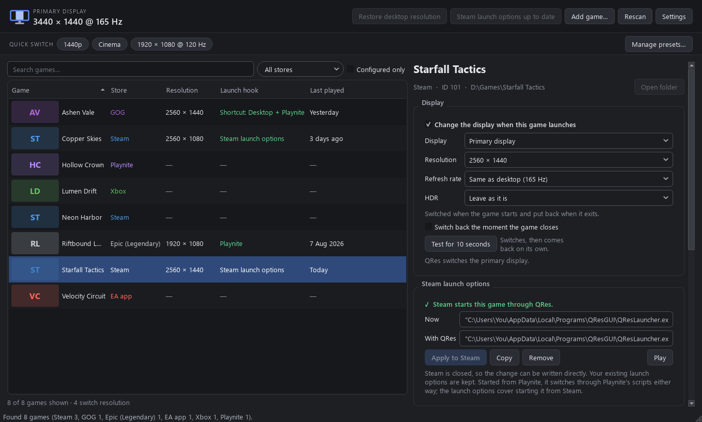
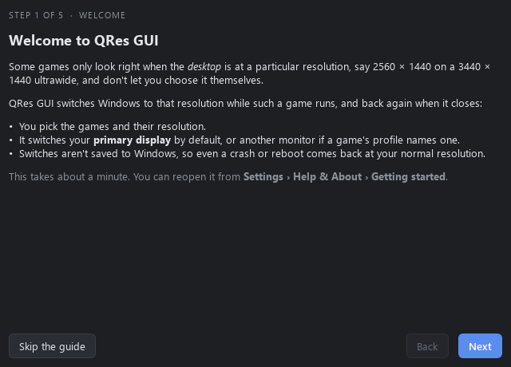
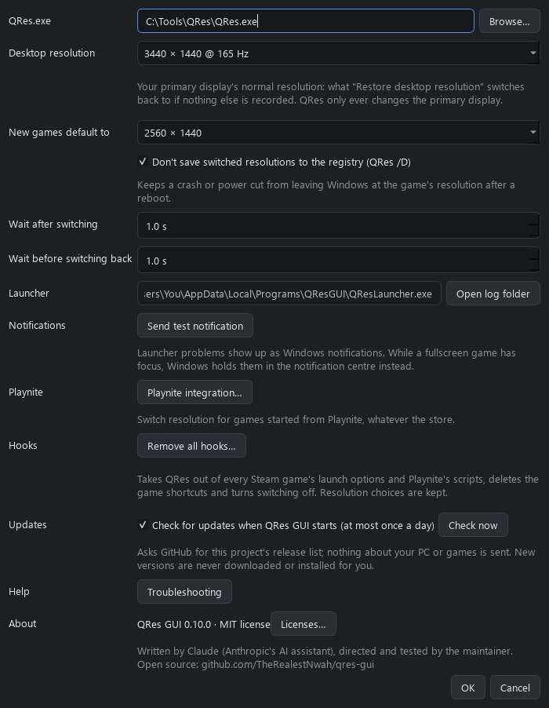
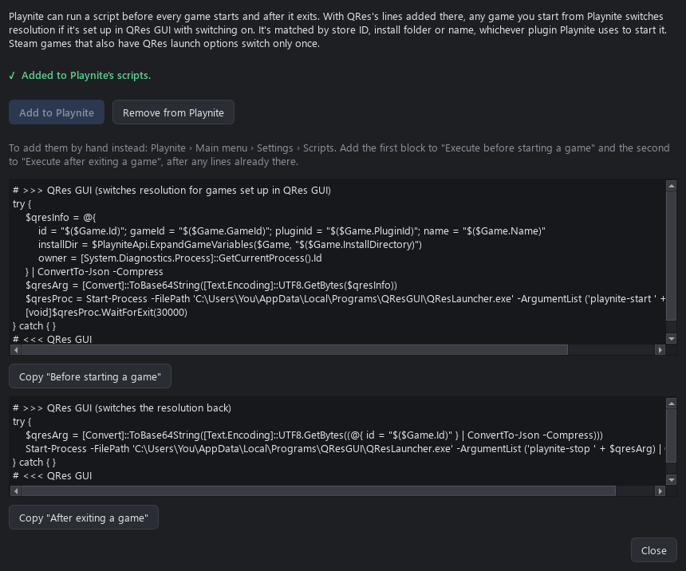

# QRes GUI

Switch Windows to a different desktop resolution while a particular game runs,
and back again when it closes. Made for games that only render correctly when
the *desktop* is at, say, 2560 × 1440 on a 3440 × 1440 ultrawide, because they
don't let you pick an exact resolution themselves.

Resolution changes go through **QRes** (`QRes.exe` v1.1 by Anders Kjersem), a
small command-line tool that isn't included here. Get it separately and point
QRes GUI at it, or drop it into the install folder. Without it, QRes GUI uses
the Windows display API directly.

> **Status: early pre-release (0.10.0).** Versions go 0.1.0, 0.2.0, … and
> are marked as pre-releases on GitHub until the first stable release.
> Verified on real hardware:
> launching a Steam game through its launch options (MGS4, including its
> launcher handing off to the game), switching back when it closes, Steam's
> *Stop* button (closes the game and switches back), the Steam overlay,
> launch options surviving a Steam restart, starting that game from Playnite
> (one switch, back on quit), and the installer. Not yet tested: anti-cheat
> games, Playnite with non-Steam plugins, and Epic / Ubisoft / Heroic /
> Amazon / legendary / nile / EA / Battle.net / Xbox detection. Expect rough edges, and please report
> what you find.
>
> Windows 10/11 only. The executables aren't code-signed, so SmartScreen may
> warn the first time you run them.

**[Download the latest release](https://github.com/TheRealestNwah/qres-gui/releases)** ·
**[Troubleshooting](docs/TROUBLESHOOTING.md)** · **[Changelog](CHANGELOG.md)**



<details>
<summary>More screenshots</summary>







</details>

## How it works

`QResLauncher.exe` sits between the store and the game:

1. It switches to the game's resolution, keeping the desktop's refresh rate
   unless you pick another.
2. It starts the game and follows every process the game starts, including
   ones whose launcher has already exited.
3. When they've all closed, it switches back.

How the launcher gets in the loop depends on the store:

| Store | Hook | Detected from |
|---|---|---|
| Steam | Launch options become `"…\QResLauncher.exe" run steam:<appid> %command%` (your existing options are kept) | `libraryfolders.vdf`, `appmanifest_*.acf`, `localconfig.vdf` |
| GOG (Galaxy, Heroic, offline installers) | Desktop / Start menu shortcut that runs the game's exe through the launcher | `HKLM\SOFTWARE\WOW6432Node\GOG.com\Games` |
| Epic Games | Shortcut that opens the game through Epic's URL, then waits for the game's exe | Launcher manifests (`*.item`) |
| Ubisoft Connect | Shortcut that opens the game through `uplay://`, then waits for the game's exe (guessed; check it) | `HKLM\…\Ubisoft\Launcher\Installs` |
| Heroic (Epic, Amazon) | Shortcut that opens the game through `heroic://launch`, then waits for the game's exe | `%APPDATA%\heroic\legendaryConfig\…\installed.json`, `nile_config\…\installed.json` |
| Heroic (GOG) | Shortcut that runs the game's exe through the launcher (listed once if Windows also knows it as a GOG game) | `%APPDATA%\heroic\gog_store\installed.json` + `goggame-<id>.info` |
| Amazon Games app | Shortcut that opens the game through `amazon-games://`, then waits for the exe named in its `fuel.json` | `%LOCALAPPDATA%\Amazon Games\…\GameInstallInfo.sqlite` |
| Legendary / nile, e.g. through Playnite's Legendary and Nile plugins | Started from Playnite (see below); QRes can't start these itself | `%USERPROFILE%\.config\legendary\installed.json`, `%APPDATA%\nile\installed.json` |
| GOG OSS (Playnite plugin) | Shortcut that runs the game's exe (listed once if Windows also knows it as a GOG game) | `%APPDATA%\Playnite\ExtensionsData\03689811-…\installed.json` |
| EA app | Shortcut that runs the game's exe (it signs in through the EA app), then waits for that exe | "Apps & features" entries with `__Installer\installerdata.xml` |
| Battle.net | Started from Battle.net or Playnite | "Apps & features" entries using Battle.net's uninstaller (`--uid=`) |
| Xbox app / PC Game Pass | Shortcut that opens the game through `shell:AppsFolder`, then waits for its exe | `.GamingRoot` on each drive + each game's `MicrosoftGame.config` |
| **Anything started from Playnite** | Playnite's global game scripts (see below) | Matched to a QRes profile by store ID, install folder or name. Games QRes doesn't know yet are listed automatically the first time Playnite starts them |
| Anything else | **Add game…** and point at the exe | — |

For non-Steam games, start the game from the `… (QRes)` shortcut (or **Play**),
not from the store's own button. The store can't be told to go through the launcher.

### Playnite

**Settings › Playnite integration… › Add to Playnite** adds a short block to
Playnite's global *before starting a game* and *after exiting a game* scripts,
after any lines of your own. Playnite has to be closed, because it saves its
settings when it exits, and a backup is kept. Or copy the blocks from the same
dialog into Playnite › Settings › Scripts yourself.

From then on, starting a game in Playnite, through any library plugin, switches
the resolution if the game has a QRes profile with switching on. The profile
is found by store ID, then install folder, then name. Playnite starts and
tracks the game and runs the exit script when it stops, which switches back.
If Playnite closes mid-game, the guard switches back.

A Steam game that also has QRes launch options switches only once when started
from Playnite, and still switches when started from Steam directly.

### Safety nets

- By default the switch is **temporary** (QRes `/D`). It's never written to
  the registry, so a reboot always comes back at your normal resolution.
- Before switching, the launcher records the desktop mode in
  `%APPDATA%\QResGUI\session.json` and starts a small detached guard process.
- Steam's *Stop* button ends the launcher, the process Steam started. The
  game is tied to the launcher, so it closes too, as Steam expects. A normal
  exit never closes anything.
- If whatever owns the switch goes away while the game is still running
  (Playnite restarting for an add-on update, the launcher killed), the guard
  takes over, keeps watching the game's processes, and switches back when the
  game exits.
- If both are killed anyway, the GUI notices on its next start and offers to
  restore. **Restore desktop resolution** in the top bar also works any time,
  as does `QResLauncher.exe restore`.

### Notifications

The launcher never stops to show a dialog. If it can't switch or switch back,
or the guard had to step in, you get a Windows notification. The game still
starts at your current resolution if switching failed. While a fullscreen
game has focus, Windows holds notifications in the notification centre
instead of popping them up, so QRes GUI also shows the latest one in a banner
until you dismiss it. **Settings › Send test notification** checks they work.

### Updates

At most once a day, QRes GUI asks GitHub for this project's release list. If
there's a newer version, a banner offers **What's new** (the release page) or
**Later** (hidden until the next version). Nothing about your PC or games is
sent, and nothing is downloaded or installed for you. Turn it off, or **Check
now**, under **Settings › Updates**.

## Using it

1. Install:
   - **From a release:** download `QResGUI-<version>-win64.zip` from
     [Releases](https://github.com/TheRealestNwah/qres-gui/releases), extract it
     and double-click `install.cmd`.
   - **From source:** run `.\install.ps1` (see Development).

   Either way it installs to `%LOCALAPPDATA%\Programs\QResGUI` and adds
   **QRes GUI** to the Start menu and to *Settings › Apps*. Installing a newer
   version the same way updates it in place. The folder never moves, so
   existing hooks keep working.
2. Open **QRes GUI**. The first time, a short **Getting started** guide finds
   QRes.exe, confirms your resolutions, adds QRes to Playnite if you use it, and
   sets up a first game. Later: select a game, tick **Switch resolution when this game
   launches** and pick the resolution. **Test for 10 seconds** tries the mode
   and switches back on its own. **Switch back the moment the game closes**
   skips the few seconds normally allowed for games that restart themselves.
3. Hook it up:
   - **Steam:** close Steam (the **Close Steam** button asks it to exit), then
     **Apply to Steam**, or **Update Steam launch options** in the top bar to do
     every enabled game at once. Steam overwrites `localconfig.vdf` when it
     exits, so writing is blocked while it runs. **Copy** gives you the string
     to paste into *Properties › General › Launch options* by hand instead. A
     timestamped backup of `localconfig.vdf` is kept next to it (last 5).
   - **Other stores:** **Create desktop shortcut** / **Add to Start menu**.
4. **Game process** (optional for Steam and GOG, required for games started
   through a store link: Epic, Ubisoft, Heroic's Epic/Amazon, Amazon Games):
   the exe name(s) to wait for. Use it when a game hands off to a different exe,
   or leaves a launcher running after you quit.

### Removing it

- **Settings › Remove all hooks…** takes QRes out of every Steam game's launch
  options (keeping your own options) and out of Playnite's scripts (keeping
  your own lines), deletes the game shortcuts and turns switching off.
- **Uninstall** from *Settings › Apps* (or run `uninstall.ps1` in the install
  folder) does the same first, so no game is left pointing at a missing
  launcher. It then removes the program. It offers to close Steam if needed and
  asks before deleting your settings.

## Development

```powershell
py -3.13 -m venv .venv
.venv\Scripts\python -m pip install -r requirements-dev.txt
.venv\Scripts\pythonw QResGUI.pyw         # run from source
.venv\Scripts\python -m pytest            # tests (don't change the real resolution)
.\build.ps1                               # -> dist\QResGUI\
.\install.ps1                             # build + install for the current user
.\package.ps1                             # build + release\QResGUI-<version>-win64.zip
```

The version lives in `qres_gui/__init__.py` (mirrored in `pyproject.toml`).

**Releases are built by CI.** GitHub Actions (`.github/workflows/ci.yml`) runs the
tests and builds the zip on every push, and publishes a release when a
`v<version>` tag is pushed. Steps and the 1.0 checklist: [docs/RELEASING.md](docs/RELEASING.md);
signing options: [docs/CODE_SIGNING.md](docs/CODE_SIGNING.md). `tools/screenshots.py` regenerates the README screenshots from a
made-up demo library.

Run from source, the GUI writes launch options that call
`.venv\Scripts\pythonw.exe QResLauncher.pyw`. That works, but the built exe
is the stable target.

Layout:

- `qres_gui/display.py`: read modes (EnumDisplaySettings), switch via QRes / API
- `qres_gui/launcher.py`: the `run` / `restore` / `remove-hooks` / `guard` entry points
- `qres_gui/hooks.py`: finds and removes Steam launch options and game shortcuts
- `qres_gui/notify.py`: toast notifications and the event record behind the GUI banner
- `qres_gui/playnite.py`: Playnite script blocks, matching Playnite games to profiles
- `qres_gui/vdf.py`: Valve KeyValues reader/writer (round-trips Steam's files byte for byte)
- `qres_gui/stores/`: per-store detection; `steam.py` also edits launch options
- `qres_gui/gui/`: PySide6 UI
- Logs: `%APPDATA%\QResGUI\launcher.log`

## Known limitations

- Only the primary display is switched (QRes's own behaviour).
- Games from any store work through Playnite: start one there once and it
  appears in QRes GUI, ready to set up.
- Heroic, Amazon Games, standalone legendary / nile, EA app, Battle.net and
  Xbox detection follows those tools' file formats but hasn't been tried
  against a real install yet.
- The Playnite integration relies on Playnite noticing when the game exits.
  If a plugin reports the game as stopped too early, the resolution switches
  back early too.
- Some anti-cheat launchers dislike being started by another process. If a game
  refuses, remove the hook and use **Test** / manual switching instead.
- After the game exits, switching back waits about 4 s (3 s to allow for games
  that restart themselves, plus the configurable restore delay) unless the game
  has **Switch back the moment the game closes** ticked.

## How it was made

QRes GUI was written by [Claude](https://www.anthropic.com/claude) (Anthropic's
AI assistant) in Claude Code, directed and tested by the repository owner. AI
wrote effectively all of the code, tests and docs. It's reviewed before each
release, but treat it as you would any early software from a single maintainer:
read the code if that matters to you (it's all here and MIT-licensed), and see
[Known limitations](#known-limitations) for what hasn't been tested on real
hardware.

## License

MIT; see [LICENSE](LICENSE). The download also contains Qt / PySide6 (LGPL-3.0),
Python and a few other libraries; see [THIRD_PARTY_NOTICES.md](THIRD_PARTY_NOTICES.md)
and the `licenses` folder. QRes itself is a separate program with its own terms.
Changes between versions: [CHANGELOG.md](CHANGELOG.md).
