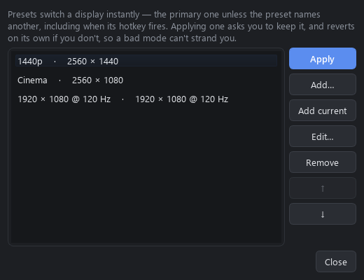

# QRes GUI

Switch Windows to a different desktop resolution while a particular game runs,
and back again when it closes. Made for games that only render correctly when
the *desktop* is at, say, 2560 × 1440 on a 3440 × 1440 ultrawide, because they
don't let you pick an exact resolution themselves.

Resolution changes go through **QRes** (`QRes.exe` v1.1 by Anders Kjersem), a
small command-line tool that isn't included here. Get it separately and point
QRes GUI at it, or drop it into the install folder. Without it, QRes GUI uses
the Windows display API directly.

> **Tested with** a Steam game (MGS4, including its launcher handing off to
> the game) launched from Steam and from Playnite: switching once, switching
> back on quit, Steam's *Stop* button (closes the game and switches back), the
> Steam overlay, launch options surviving a Steam restart, and a GOG game
> (Stardew Valley) started from Playnite. Also the installer. Per-game HDR on
> an HDR ultrawide: turned off for the game and put back on a normal quit,
> Steam's *Stop*, the game being killed in Task Manager, and **Restore desktop
> resolution** mid-game.
>
> **Not yet tested on real hardware:** switching a second monitor (per-game
> display selection, new in 1.3.0). It's built to the Windows display API and
> covered by tests, but hasn't been run with more than one screen connected.
>
> **Not yet tested on real installs:** anti-cheat games, and detection for
> Epic / Ubisoft / Heroic / Amazon / EA / Battle.net / Xbox (built to those
> tools' file formats). Playnite covers those stores anyway. Please report
> anything you hit.
>
> Windows 10/11 only. The executables aren't code-signed, so SmartScreen may
> warn the first time you run them.

**[Download the latest release](https://github.com/TheRealestNwah/qres-gui/releases)** ·
**[Troubleshooting](docs/TROUBLESHOOTING.md)** · **[Changelog](CHANGELOG.md)**


<details>
<summary>More screenshots</summary>





</details>

## How it works

`QResLauncher.exe` sits between the store and the game:

1. It switches the game's display to its resolution, keeping that screen's
   refresh rate unless you pick another, and switches HDR if the profile asks.
2. It starts the game and follows every process the game starts, including
   ones whose launcher has already exited.
3. When they've all closed, it switches back.

How the launcher gets in the loop depends on the store:

| Store | Hook | Detected from |
|---|---|---|
| Steam | Launch options become `"…\QResLauncher.exe" run steam:<appid> %command%` (your existing options are kept) | `libraryfolders.vdf`, `appmanifest_*.acf`, `localconfig.vdf` |
| GOG (Galaxy, Heroic, offline installers) | Desktop / Start menu shortcut that runs the game's exe through the launcher | `HKLM\SOFTWARE\WOW6432Node\GOG.com\Games` |
| Epic Games | Shortcut that opens the game through Epic's URL, then waits for the game's exe | Launcher manifests (`*.item`) |
| Ubisoft Connect | Shortcut that opens the game through `uplay://`, then waits for the game's exe (guessed; check it) | `HKLM\…\Ubisoft\Launcher\Installs` |
| Heroic (Epic, Amazon) | Shortcut that opens the game through `heroic://launch`, then waits for the game's exe | `%APPDATA%\heroic\legendaryConfig\…\installed.json`, `nile_config\…\installed.json` |
| Heroic (GOG) | Shortcut that runs the game's exe through the launcher (listed once if Windows also knows it as a GOG game) | `%APPDATA%\heroic\gog_store\installed.json` + `goggame-<id>.info` |
| Amazon Games app | Shortcut that opens the game through `amazon-games://`, then waits for the exe named in its `fuel.json` | `%LOCALAPPDATA%\Amazon Games\…\GameInstallInfo.sqlite` |
| Legendary / nile, e.g. through Playnite's Legendary and Nile plugins | Started from Playnite (see below); QRes can't start these itself | `%USERPROFILE%\.config\legendary\installed.json`, `%APPDATA%\nile\installed.json` |
| GOG OSS (Playnite plugin) | Shortcut that runs the game's exe (listed once if Windows also knows it as a GOG game) | `%APPDATA%\Playnite\ExtensionsData\03689811-…\installed.json` |
| EA app | Shortcut that runs the game's exe (it signs in through the EA app), then waits for that exe | "Apps & features" entries with `__Installer\installerdata.xml` |
| Battle.net | Started from Battle.net or Playnite | "Apps & features" entries using Battle.net's uninstaller (`--uid=`) |
| Xbox app / PC Game Pass | Shortcut that opens the game through `shell:AppsFolder`, then waits for its exe | `.GamingRoot` on each drive + each game's `MicrosoftGame.config` |
| **Anything started from Playnite** | Playnite's global game scripts (see below) | Matched to a QRes profile by store ID, install folder or name. Games QRes doesn't know yet are listed automatically the first time Playnite starts them |
| Anything else | **Add game…** and point at the exe | — |

For non-Steam games, start the game from the `… (QRes)` shortcut (or **Play**),
not from the store's own button. The store can't be told to go through the launcher.

### Games started some other way

**Settings › Switching › Switch for games however they're started** covers the
rest: the Xbox app, the EA app, Ubisoft Connect, Battle.net, a store's own Play
button. While QRes GUI is running, it notices a game with switching on starting
— an exe inside that game's install folder, or a process name the profile
watches — and hands it to the launcher, which switches while the game runs and
back once it's gone, with the same guard and restore as any other launch. Hooks
still come first: a game started through Steam's launch options, Playnite or a
QRes shortcut has already switched, and isn't switched twice. Runtime
installers, crash reporters and uninstallers in a game's folder don't count.

The switch comes a moment after the game starts rather than before, so a game
that reads the screen size in its first second may still see the old one; a
hook is better wherever the store has one. QRes GUI has to be running for this,
so turn on **Keep running in the tray** or **Start with Windows, in the tray**
(Settings › Tray & hotkeys). A game already running when QRes GUI starts isn't
switched. Games covered this way show **When it starts** in the Launch hook
column.

Games you never want to see — tools, soundtracks, things you've finished — can
be taken out of the list: right-click › **Hide from list**. Hiding only tidies
the list; a hidden game keeps its profile and still switches when you start it.
While anything is hidden, the line under the list says how many, with a
**Show** link to bring them back (right-click › **Show in list**).

Click a column heading to sort the list. **Last played** says when a game was
last started through QRes, or by Steam for Steam games, whichever is later;
sorting by it puts the most recent first. The list remembers how you sorted it.

**History** in the top bar lists recent launches, newest first: when each
started, how long it ran, what started it (Steam, QRes GUI's Play button, a
shortcut, Playnite, or QRes noticing it start), and whether the desktop came
back afterwards — **Restored**, **Restored except HDR** (or scaling, or the
playback device), **Not restored**, or **Restored late** when QRes's safety net
or the Restore button had to do it. Right-click a game › **Launch history…**
shows just that game. It keeps the last 500 launches in
`%APPDATA%\QResGUI\history.json`, only on this PC — backups leave it out, and
**Clear history** empties it without touching Last played.

### Playnite

**Settings › Integrations › Playnite integration… › Add to Playnite** adds a short block to
Playnite's global *before starting a game* and *after exiting a game* scripts,
after any lines of your own. Playnite has to be closed, because it saves its
settings when it exits, and a backup is kept. Or copy the blocks from the same
dialog into Playnite › Settings › Scripts yourself.

From then on, starting a game in Playnite, through any library plugin, switches
the resolution if the game has a QRes profile with switching on. The profile
is found by store ID, then install folder, then name. Playnite starts and
tracks the game and runs the exit script when it stops, which switches back.
If Playnite closes mid-game, the guard switches back.

A Steam game that also has QRes launch options switches only once when started
from Playnite, and still switches when started from Steam directly.

### Choosing a display

By default a game switches the **primary display**, which is what QRes GUI
always did. A profile can name a different screen instead — the **Display** row
at the top of a game's Display box lists every monitor Windows reports, and the
resolution and refresh-rate choices below it then come from *that* screen.

*Primary display* is the default rather than a specific monitor on purpose: it
follows whichever screen Windows currently calls primary, so it survives
re-plugging and swapping cables. Pick a named display when you mean that
monitor specifically.

QRes.exe itself takes no monitor argument, so it can only ever drive the
primary display. A named secondary screen is switched through the Windows
display API instead, which is per-monitor; the panel says so when you pick one.
Nothing changes for primary-display profiles, which still go through QRes first.

### Choosing audio

In the profile's **Audio** box, choose the Windows playback device the game
should use, or leave it alone. QRes GUI records your current default output,
sets the selected device for the game, and puts the old one back when the game
ends — including after Steam's **Stop**, Playnite's stop script, the launcher
guard, or **Restore desktop resolution**. It changes the Windows console,
media and communications defaults together. If a headset or other saved device
is unplugged, the game simply starts with Windows' current audio instead.

The display is recorded alongside the resolution, so the safety nets put back
the screen that was changed rather than whichever happens to be primary later.
If a profile names a monitor that isn't plugged in, QRes GUI switches **nothing**
and says so — quietly switching a different screen would be worse than leaving
it alone. The game still starts.

Presets name a display too, in the preset editor, and their global hotkeys
follow it — a hotkey fires with no window in front of you, so the screen has to
come from the preset itself. A preset whose display isn't plugged in switches
nothing and says so.

### HDR

A game's profile can also turn **HDR** on or off while it runs and put it back
when it exits — on for a game that wants it, off so an SDR game doesn't come out
washed out. QRes can't do this, so QRes GUI goes to the Windows display API
(`DisplayConfig`, Windows 10 1709 and later). HDR follows the same screen the
profile switches, so the two never land on different monitors.

The control sits with the resolution in the game's **Display** box: *Leave as it
is* (the default, nothing changes), *Turn on for this game*, *Turn off for this
game*. If your display, driver or Windows build can't switch HDR, it's greyed
out and says why.

HDR never holds a game up. If the switch fails you get a notification and the
game starts regardless. The desktop's HDR state goes into `session.json` beside
the resolution, so the same safety nets below put it back — the guard,
**Restore desktop resolution**, and `QResLauncher.exe restore`.

Expect the display to go black for a second or two each way: switching HDR makes
it re-sync.

### Scaling

When a game runs at a size smaller than the display — 2560 × 1440 on an
ultrawide, say — **Scaling** in the same box decides how it's shown: *Keep
aspect ratio* (black bars at the sides), *Centered, no scaling* (a smaller
picture in the middle), or *Stretch to fill*. *Leave as it is*, the default,
keeps whatever your display or graphics driver does now. It's set just after
the resolution switches and put back with it, through the same safety nets as
HDR, and never saved to Windows' display settings. **Test for 10 seconds**
tries it along with the resolution.

The graphics driver has the last word. NVIDIA follows it only when its control
panel does the scaling on the GPU (*Adjust desktop size and position › Perform
scaling on: GPU*); a display doing its own scaling can ignore it.

### Custom launch arguments

A game's **Extra arguments** box takes `-windowed`, `-skipintro` and the like.
Where they apply depends on what starts the game, and the box says which:

- **Steam games:** added after the game's own command whenever Steam starts it
  through QRes — from Steam, or from Playnite through Steam. Your own Steam
  launch options are kept, and changing the arguments doesn't need Steam closed.
- **Games QRes GUI starts itself** (GOG, EA, Amazon, standalone): added after
  the store's own arguments when a shortcut QRes made, or **Play**, starts it.
  A rescan that refreshes the store's launch details leaves them alone.
- **Games Playnite starts directly:** Playnite builds that command line, so set
  arguments there (right-click the game › Edit › Actions); the box says so
  instead of offering a field that would be ignored.

Hand-added games have a full **Arguments** field of their own, since there's no
store command line to add to.

For games made with **Unity** or **Unreal Engine**, the box also offers that
engine's own options as choices — window mode (borderless, exclusive
fullscreen, windowed), graphics API (Direct3D 11 / 12, Vulkan), for Unity
which monitor, and **Start at this game's resolution**, which tells the game the
size its profile switches to (`-screen-width`/`-screen-height` for Unity,
`-ResX`/`-ResY` for Unreal) so a borderless game fills the switched desktop
instead of remembering an older size — and shows exactly what they add. QRes GUI tells the engine from
files in the game's folder; nothing is looked up online. The options are the
ones each engine documents for every game made with it
([Unity](https://docs.unity3d.com/Manual/PlayerCommandLineArguments.html),
[Unreal](https://dev.epicgames.com/documentation/en-us/unreal-engine/unreal-engine-command-line-arguments-reference)),
but a game can still choose to ignore them. Anything you type goes after them.

### Commands before and after the switch

A game's **Commands** box runs something just before QRes switches the display
for it, and something else after it switches back: close an app that doesn't
like resolution changes, start a frame limiter, turn an overlay off and on
again. **Settings › Switching** has the same two for every game; those run
first before the switch and last after it, so each undoes in the order it set
up.

Commands are typed as in a Command Prompt. QRes waits up to 15 seconds for
each and then carries on, so anything that keeps running (a limiter, an
overlay) is left to run, and a failing command never stops a game from
starting. The "after" commands run however the switch ends: the game exiting,
Steam's *Stop*, Playnite's stop script, or **Restore desktop resolution**.
They're given `QRES_EVENT` (`before` / `after`), `QRES_GAME` and
`QRES_GAME_ID`, so a command for every game can tell them apart.

Commands only run when a switch actually happens. Backups carry them, and
importing a file that adds commands lists every one of them, word for word,
before anything is applied — only import a profile file you trust.

### Quick resolution switching

The **Quick switch** strip under the top bar changes your primary display's
resolution right away — no game needed. Save presets (**Manage presets…**) and
each becomes a one-click chip. Applying one asks *Keep this resolution?* and
reverts on its own after 15 seconds if you don't confirm, so a black or
unsupported screen fixes itself.

A preset only works if Windows offers that resolution. For a size that isn't in
the list, create it as a **custom resolution** in your graphics control panel
(NVIDIA, AMD or Intel) first; QRes GUI flags presets that aren't available yet
and explains this if a switch fails.

**Tray icon and global hotkeys.** QRes GUI shows a system-tray icon (right-click
for presets, restore and quit). Give any preset — or *Restore desktop
resolution* — a system-wide hotkey (**Settings**, or a preset's editor) that
works from anywhere, including inside a game. Hotkeys need a modifier, e.g.
`Ctrl+Alt+1`. For them to work while the window is closed, turn on **keep
running in the tray** in Settings.

### Safety nets

- By default the switch is **temporary** (QRes `/D`). It's never written to
  the registry, so a reboot always comes back at your normal resolution.
- Before switching, the launcher records the desktop mode in
  `%APPDATA%\QResGUI\session.json` and starts a small detached guard process.
- Steam's *Stop* button ends the launcher, the process Steam started. The
  game is tied to the launcher, so it closes too, as Steam expects. A normal
  exit never closes anything.
- If whatever owns the switch goes away while the game is still running
  (Playnite restarting for an add-on update, the launcher killed), the guard
  takes over, keeps watching the game's processes, and switches back when the
  game exits.
- If both are killed anyway, the GUI notices on its next start and offers to
  restore. **Restore desktop resolution** in the top bar also works any time,
  as does `QResLauncher.exe restore`.

### Notifications

The launcher never stops to show a dialog. If it can't switch or switch back,
or the guard had to step in, you get a Windows notification. The game still
starts at your current resolution if switching failed. While a fullscreen
game has focus, Windows holds notifications in the notification centre
instead of popping them up, so QRes GUI also shows the latest one in a banner
until you dismiss it. **Settings › Integrations › Send test notification** checks they work.

### Backing up profiles

**Settings › Help & About › Back up and restore…** exports your game profiles,
presets and settings to a file you can keep or carry to another PC. It leaves
out everything that only describes this machine — where QRes.exe is, the
desktop resolution, and the paths the stores report, which a rescan fills in
again. Importing matches games by their store ID and works one of two ways:
**Restore** makes everything match the file, removing profiles and presets set
up since it was made — for undoing changes — while **Merge** adds and updates
what the file names and leaves everything else alone, for bringing profiles to
another PC. Either way it shows you exactly what will change before applying
anything.

A display a profile names is kept only if a monitor of the same name and number
is connected; otherwise that profile falls back to the primary display rather
than aiming at whichever screen happens to be second.

### Diagnostics

**Settings › Help & About › Diagnostics…** shows what QRes GUI can see: its version and where
it keeps its settings and log, the Windows build, which QRes.exe it found, every
connected display with the mode it's running, whether HDR is available on each —
and the reason in Windows' own words when it isn't — any switch being tracked
right now and what it will restore, the Playnite and notification state, and the
last update check. Anything that went wrong is highlighted, and **Copy for a bug
report** puts it all on the clipboard as plain text. Nothing is sent anywhere,
and opening it never starts an update check.

For one game, **Check readiness…** (in its Display box, or right-click it in
the list) checks its profile against the PC as it is now, without switching
anything: that the display it names is plugged in, that Windows offers its
resolution and refresh rate there, whether QRes or the Windows API will switch
it, whether HDR and scaling can change on that display, whether its playback
device is active, how it gets started and that its exe is still there, and
whether another game's switch is still in place. Anything that would keep part
of the profile from applying is highlighted with what to do about it.

### Updates

At most once a day, QRes GUI asks GitHub for this project's release list. If
there's a newer version, a banner offers **Install update**, **What's new** (the
release page) or **Later** (hidden until the next version). Nothing about your
PC or games is sent, and nothing is downloaded until you click **Install
update**. Turn the check off, or **Check now**, under **Settings › Updates**.

**Install update** downloads the release zip from this project's GitHub
releases, checks it against the SHA-256 checksum GitHub lists for it, then
closes QRes GUI, runs the zip's `install.ps1` — the same as installing by hand —
and opens QRes GUI again. Profiles, settings and hooks are kept. It's only
offered in the installed copy, and not while a game is running through QRes;
if installing fails, the next start says why and you keep the version you had.

## Using it

1. Install:
   - **From a release:** download `QResGUI-<version>-win64.zip` from
     [Releases](https://github.com/TheRealestNwah/qres-gui/releases), extract it
     and double-click `install.cmd`.
   - **From source:** run `.\install.ps1` (see Development).

   Either way it installs to `%LOCALAPPDATA%\Programs\QResGUI` and adds
   **QRes GUI** to the Start menu and to *Settings › Apps*. Installing a newer
   version the same way updates it in place. The folder never moves, so
   existing hooks keep working.
2. Open **QRes GUI**. The first time, a short **Getting started** guide finds
   QRes.exe, confirms your resolutions, adds QRes to Playnite if you use it, and
   sets up a first game. Later: select a game, tick **Change the display when this
   game launches** and pick the resolution (and HDR, if you want it switched). **Test for 10 seconds** tries the mode
   and switches back on its own. **Switch back the moment the game closes**
   skips the few seconds normally allowed for games that restart themselves.
3. Hook it up:
   - **Steam:** close Steam (the **Close Steam** button asks it to exit), then
     **Apply to Steam**, or **Update Steam launch options** in the top bar to do
     every enabled game at once. Steam overwrites `localconfig.vdf` when it
     exits, so writing is blocked while it runs. **Copy** gives you the string
     to paste into *Properties › General › Launch options* by hand instead. A
     timestamped backup of `localconfig.vdf` is kept next to it (last 5).
   - **Other stores:** **Create desktop shortcut** / **Add to Start menu**.
4. **Game process** (optional for Steam and GOG, required for games started
   through a store link: Epic, Ubisoft, Heroic's Epic/Amazon, Amazon Games):
   the exe name(s) to wait for. Use it when a game hands off to a different exe,
   or leaves a launcher running after you quit.

### Removing it

- **Settings › Integrations › Remove all hooks…** takes QRes out of every Steam game's launch
  options (keeping your own options) and out of Playnite's scripts (keeping
  your own lines), deletes the game shortcuts and turns switching off.
- **Uninstall** from *Settings › Apps* (or run `uninstall.ps1` in the install
  folder) does the same first, so no game is left pointing at a missing
  launcher. It then removes the program. It offers to close Steam if needed and
  asks before deleting your settings.

## Development

```powershell
py -3.13 -m venv .venv
.venv\Scripts\python -m pip install -r requirements-dev.txt
.venv\Scripts\pythonw QResGUI.pyw         # run from source
.venv\Scripts\python -m pytest            # tests (don't change the real resolution)
.\build.ps1                               # -> dist\QResGUI\
.\install.ps1                             # build + install for the current user
.\package.ps1                             # build + release\QResGUI-<version>-win64.zip
```

The version lives in `qres_gui/__init__.py` (mirrored in `pyproject.toml`).

**Releases are built by CI.** GitHub Actions (`.github/workflows/ci.yml`) runs the
tests and builds the zip on every push, and publishes a release when a
`v<version>` tag is pushed. Steps and the 1.0 checklist: [docs/RELEASING.md](docs/RELEASING.md);
signing options: [docs/CODE_SIGNING.md](docs/CODE_SIGNING.md). `tools/screenshots.py` regenerates the README screenshots from a
made-up demo library.

Run from source, the GUI writes launch options that call
`.venv\Scripts\pythonw.exe QResLauncher.pyw`. That works, but the built exe
is the stable target.

Layout:

- `qres_gui/display.py`: read modes (EnumDisplaySettings), switch via QRes / API
- `qres_gui/launcher.py`: the `run` / `restore` / `remove-hooks` / `guard` entry points
- `qres_gui/hooks.py`: finds and removes Steam launch options and game shortcuts
- `qres_gui/notify.py`: toast notifications and the event record behind the GUI banner
- `qres_gui/playnite.py`: Playnite script blocks, matching Playnite games to profiles
- `qres_gui/gui/presets.py`, `tray.py`, `hotkeys.py`: quick switch, tray icon, global hotkeys
- `qres_gui/vdf.py`: Valve KeyValues reader/writer (round-trips Steam's files byte for byte)
- `qres_gui/stores/`: per-store detection; `steam.py` also edits launch options
- `qres_gui/gui/`: PySide6 UI
- Logs: `%APPDATA%\QResGUI\launcher.log`

## Known limitations

- QRes.exe can only drive the primary display, so a named secondary screen is
  switched through the Windows API instead.
- HDR needs Windows 10 1709 or newer and a display Windows reports as
  HDR-capable; where it isn't available the control says so and stays greyed
  out. Switching it blanks the display briefly while it re-syncs.
- **Extra arguments** apply when QRes starts the game: through Steam's launch
  options (from Steam or Playnite), a shortcut it made, or **Play**. A game
  Playnite or a store's client starts directly gets that tool's own arguments.
- Games from any store work through Playnite: start one there once and it
  appears in QRes GUI, ready to set up.
- Heroic, Amazon Games, standalone legendary / nile, EA app, Battle.net and
  Xbox detection follows those tools' file formats but hasn't been tried
  against a real install yet.
- The Playnite integration relies on Playnite noticing when the game exits.
  If a plugin reports the game as stopped too early, the resolution switches
  back early too.
- Some anti-cheat launchers dislike being started by another process. If a game
  refuses, remove the hook and use **Test** / manual switching instead.
- After the game exits, switching back waits about 4 s (3 s to allow for games
  that restart themselves, plus the configurable restore delay) unless the game
  has **Switch back the moment the game closes** ticked.

## How it was made

QRes GUI was written by [Claude](https://www.anthropic.com/claude) (Anthropic's
AI assistant) in Claude Code, directed and tested by the repository owner. AI
wrote effectively all of the code, tests and docs. It's reviewed before each
release, but treat it as you would any early software from a single maintainer:
read the code if that matters to you (it's all here and MIT-licensed), and see
[Known limitations](#known-limitations) for what hasn't been tested on real
hardware.

## License

MIT; see [LICENSE](LICENSE). The download also contains Qt / PySide6 (LGPL-3.0),
Python and a few other libraries; see [THIRD_PARTY_NOTICES.md](THIRD_PARTY_NOTICES.md)
and the `licenses` folder. QRes itself is a separate program with its own terms.
Changes between versions: [CHANGELOG.md](CHANGELOG.md).
